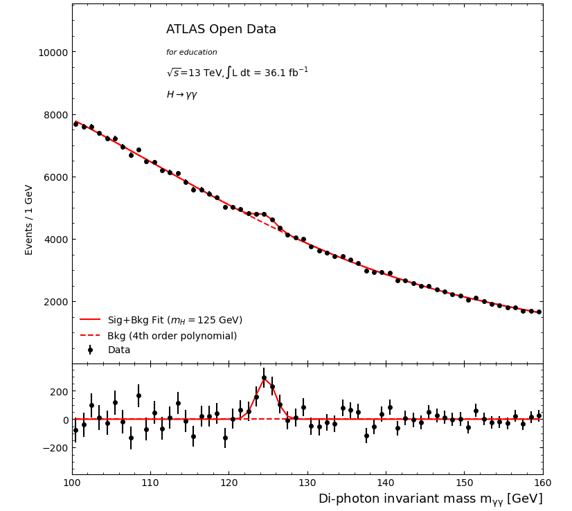

# ODF JupyterHub notebook

The [self-contained notebook](hyy-taskvine-demo.ipynb) runs the ATLAS Open Data H→γγ analysis on [ODF JupyterHub](https://jupyterhub.odf.uchicago.edu/) with worker pods created through `taskvine-gateway`.

A run on ODF on 2026-09-23 completed 16 tasks with 36,564,144 entries and 553,458 selected events in 54.3 seconds. These are observations from that run; rerun the notebook to obtain results for your environment.

